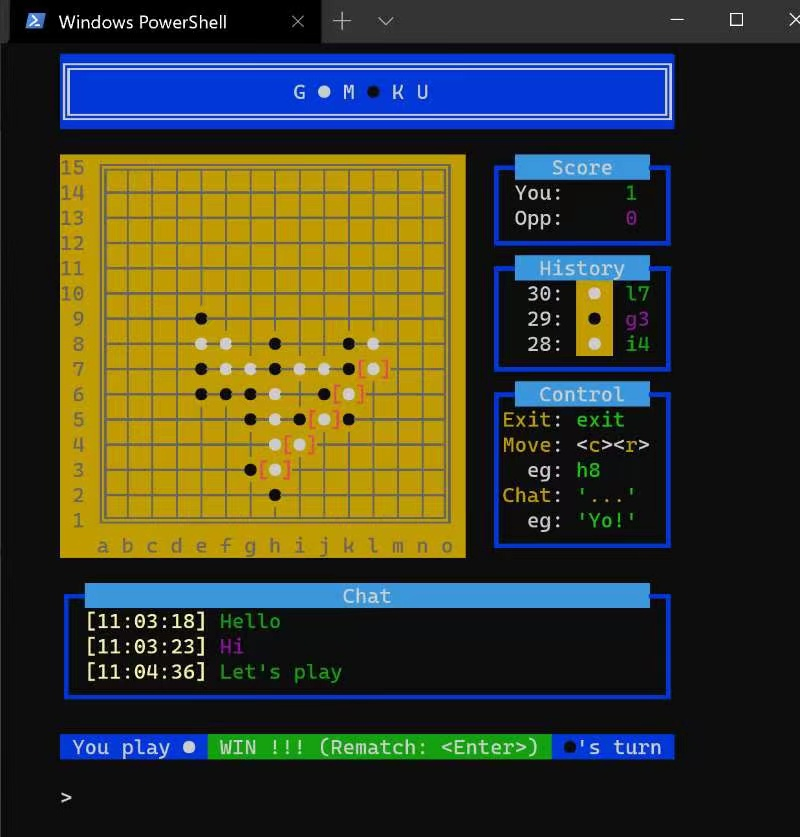
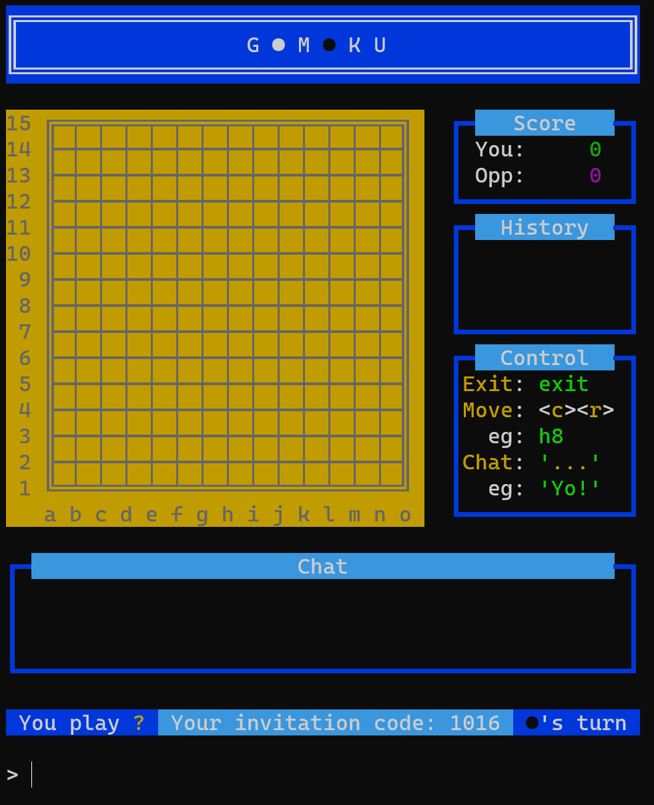
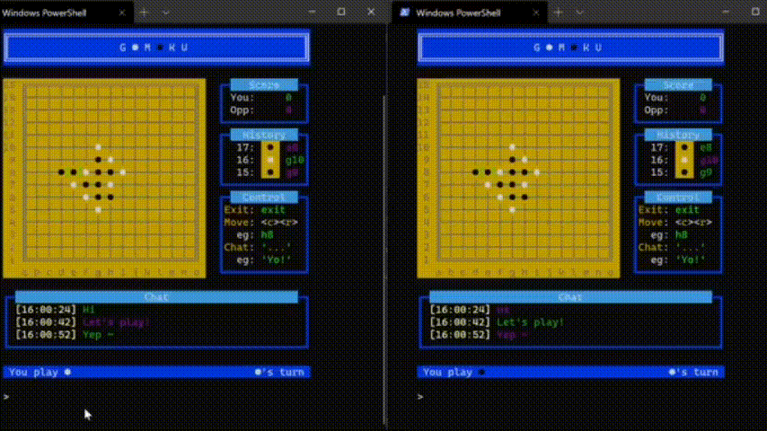

# Gomoku

Gomoku is a console Gomoku game (connect-5) written in Go. It uses Websocket to support real-time multi-client gaming and also supports chatting.



## How to play

### Download code

```sh
$ git clone https://github.com/CoderYihaoWang/gomoku.git
```

### Start the server

```sh
# from the project folder
$ go run cmd/server/main.go
```
The server starts without output.

### Start clients

Open another command line:
```sh
# from the project folder
$ go run cmd/client/main.go
```

This will display a board like the following (Notice the `Your invitation code: xxxx` line at the bottom):



Open another terminal, start a client with the invitation code:

```sh
$ go run cmd/client/main.go --code=xxxx # xxxx is the invitation code
```

Enjoy your game!

